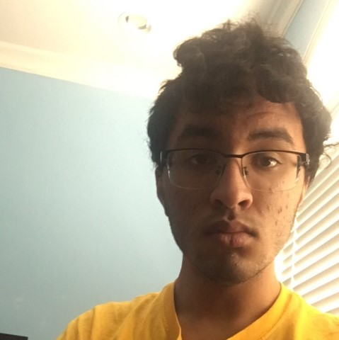
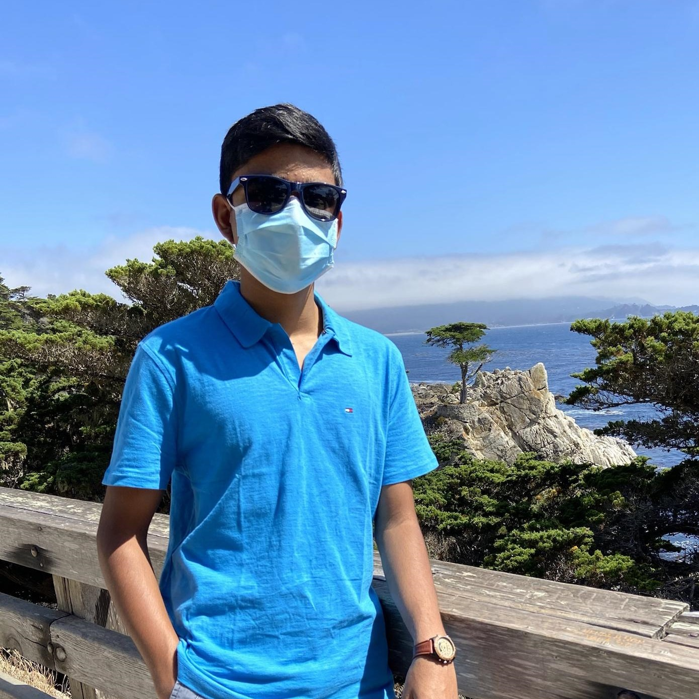
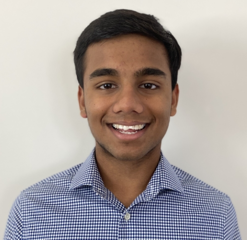

## President
**Ayush Mishra**  
IMAGE PLACEHOLDER  
TEXT PLACEHOLDER  

## Vice President
**Yash Mishra**  
IMAGE PLACEHOLDER  
TEXT PLACEHOLDER  

## PR 
**Arnav Dixit**  
  
Hi, I'm Arnav and I am going to be your Public Relations manager for the 2020-2021 school year! The vastness of Philosophy interests me. - there can be many interpretations of how to perceive reality, knowledge, and life. In my free time, I love to workout and watch sports.

## Content Dev
**Shreeram Modi**  
  
Hi, I'm Shreeram, I'm a junior and I'll be your Content Dev for 2020-21. Philosophy and how we see the world has always been interesting to me. Each person sees things slightly differently, and that difference can have huge impacts on how they live life. Through phil club I hope to both learn more and educate about different worldviews. When I have free time I play video games, trade stocks, and do debate.

## Treasurer
**Arnav Jain**  
  
Hi, I'm Arnav, I'm a junior and I will be serving as your 2020-2021 Treasurer! I joined philosophy club because I love to think and discuss many logical questions at a deeper level as it improves my critical thinking skills and makes me truly fascinated when I learn different methodologies. In my free time, I love to learn about finance/economics and play competitive soccer.
